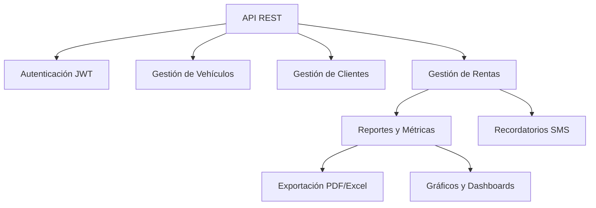
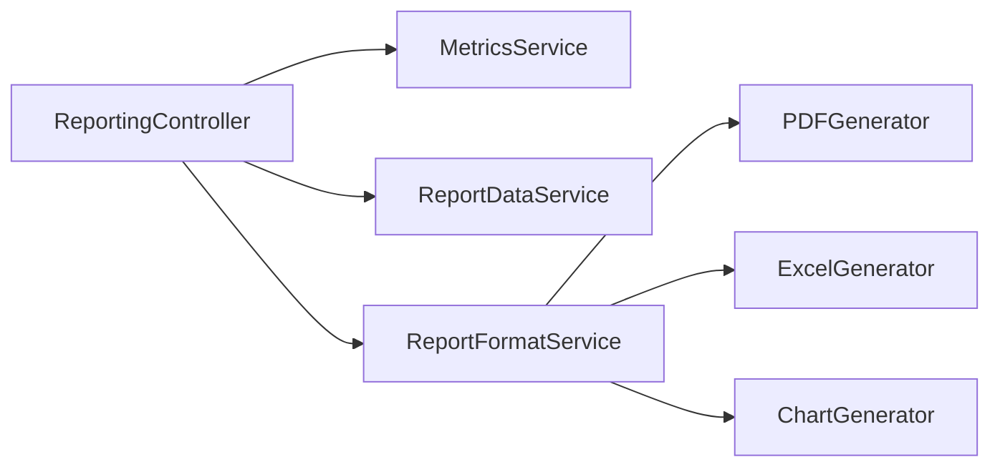
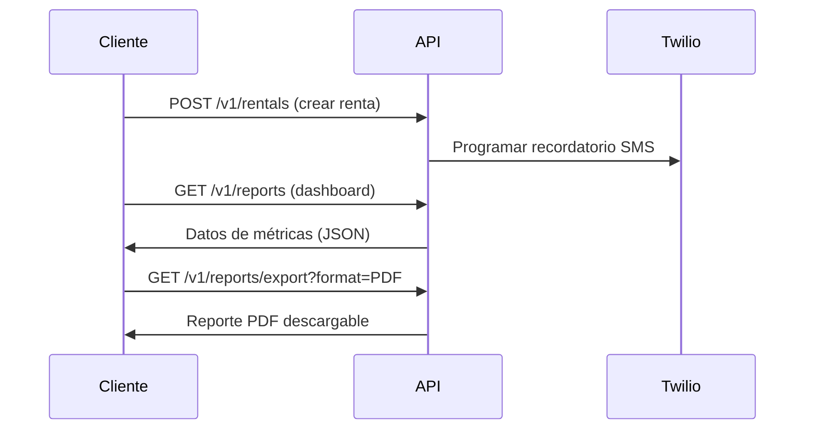

# Sistema de Gestión de Alquiler de Vehículos 🚗💨

## Tecnologías Principales
<div align="center">
  
  
  
  
  
  
  
  
</div>

## Visión General 🌐
Sistema backend robusto para gestión integral de alquiler de vehículos que maneja operaciones con vehículos, clientes y rentas con acceso seguro y controlado.

**Logros Destacados:**
- ✅ Resolución de problemas críticos de consistencia de datos
- 🔒 Implementación de seguridad con JWT y control de roles
- 📱 Sistema de mensajería SMS con Twilio
- 📊 Módulo de reportes con exportación a múltiples formatos
- ⚡ Optimización de consultas y manejo eficiente de datos



## Stack Tecnológico ⚙️
- **Backend:** Java 21, Spring Boot 3.2
- **Base de Datos:** MySQL 8.0+
- **Persistencia:** Spring Data JPA, Hibernate
- **Seguridad:** Spring Security, JWT
- **Comunicación Externa:** Twilio API
- **Documentación:** Swagger/OpenAPI 3.0
- **Herramientas:** Postman, IntelliJ IDEA

## Modelo de Datos 📊
### Entidades Principales
| Entidad       | Atributos Clave                          | Estado                           |
|---------------|------------------------------------------|----------------------------------|
| **Vehículo**  | `id`, `marca`, `modelo`, `año`, `placa` | `DISPONIBLE`, `ALQUILADO`, `MANTENIMIENTO` |
| **Cliente**   | `id`, `nombre`, `email`, `licencia`     | `ACTIVO`, `INACTIVO`, `BLOQUEADO` |
| **Renta**     | `id`, `fechaInicio`, `fechaFin`, `estado` | `ACTIVA`, `COMPLETADA`, `CANCELADA` |

## Endpoints Clave 🔑
### Autenticación
| Método | Endpoint                | Descripción                     |
|--------|-------------------------|---------------------------------|
| `POST` | `/v1/auth/register`     | Registro de nuevos usuarios     |
| `POST` | `/v1/auth/login`        | Inicio de sesión (obtener JWT)  |

### Gestión de Vehículos
| Método | Endpoint                | Rol Requerido | Función                     |
|--------|-------------------------|---------------|-----------------------------|
| `POST` | `/v1/vehicles`          | ADMIN         | Crear nuevo vehículo        |
| `GET`  | `/v1/vehicles`          | USERS/ADMIN   | Listar todos vehículos      |
| `GET`  | `/v1/vehicles/{id}`     | USERS/ADMIN   | Obtener vehículo por ID     |
| `PUT`  | `/v1/vehicles/{id}`     | USERS/ADMIN   | Actualizar vehículo         |
| `DELETE`| `/v1/vehicles/{id}`     | ADMIN         | Eliminar vehículo           |

### Reportes y Métricas


| Endpoint                          | Método | Descripción                                  |
|-----------------------------------|--------|----------------------------------------------|
| `/v1/reports`                     | `GET`  | Datos completos del dashboard                |
| `/v1/reports/export`              | `GET`  | Exportar reportes (PDF/Excel/PNG)            |
| `/v1/reports/metrics/total-rentals` | `GET`  | Obtener total de alquileres                  |
| `/v1/reports/metrics/total-revenue` | `GET`  | Obtener ingresos totales                     |
| `/v1/reports/export-metrics`      | `POST` | Exportar métricas genéricas a Excel          |

## Soluciones Técnicas Clave 🛠️
### Problemas Resueltos
1. **Fechas Inválidas en Rentas**
   - **Problema:** Valores extremos (`LocalDateTime.MAX`) causaban inconsistencias
   - **Solución:** Implementación de fechas razonables (2100-12-31)

2. **Consultas Restrictivas**
   - **Problema:** Filtros rígidos limitaban reportes dinámicos
   - **Solución:** Refactorización con servicios especializados (`ReportDataService`, `MetricsService`)

3. **Manejo de Nulos**
   - **Problema:** `NullPointerException` en parámetros no validados
   - **Solución:** Validación robusta y valores por defecto para fechas

### Arquitectura
- **Seguridad JWT:** Autenticación stateless con tokens
- **Control de Acceso:** Autorización basada en roles (ADMIN/USER)
- **Módulo de Reportes:** 
  - Separación clara entre obtención de datos y generación de formatos
  - Patrón Strategy para diferentes formatos (PDF/Excel/Gráficos)
- **Twilio Integration:** Envío automático de SMS para recordatorios

## Documentación API 📖
Acceso completo a documentación interactiva mediante Swagger UI:
```
http://localhost:8080/swagger-ui/index.html
```

## Instalación y Uso ⚡
1. Clonar repositorio:
```bash
git clone https://github.com/tu-usuario/rental-system.git
```

2. Configurar variables de entorno (.env):
```env
DB_URL=jdbc:mysql://localhost:3306/rental_db
DB_USER=root
DB_PASSWORD=secret
TWILIO_ACCOUNT_SID=your_sid
TWILIO_AUTH_TOKEN=your_token
JWT_SECRET=secure_secret
```

3. Ejecutar aplicación:
```bash
./mvnw spring-boot:run
```

## Ejemplo de Flujo ⚙️


## Contribución 🤝
¡Se aceptan pull requests! Por favor asegúrese de:
- Incluir pruebas unitarias para nuevas funcionalidades
- Mantener coherencia en el estilo de código
- Documentar nuevos endpoints en Swagger
- Actualizar el archivo CHANGELOG.md

## Licencia 📜
MIT License - Ver archivo [LICENSE](LICENSE) para detalles.
