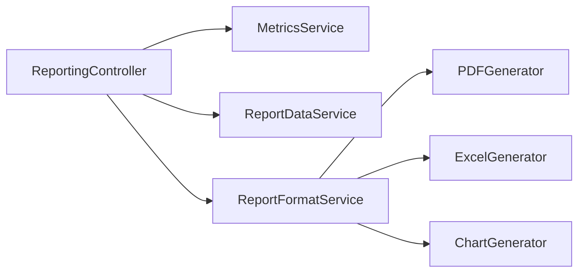

# Sistema de Gestión de Alquiler de Vehículos 🚗🚨

<div align="center">
  
  
  
  
  
  
  
  
</div>

## 🌐 Visión General del Proyecto

Sistema backend robusto para la gestión integral de alquiler de vehículos, desarrollado con **Java 21** y **Spring Boot 3.2**. Permite manejar operaciones con vehículos, clientes y rentas, con funcionalidades avanzadas de seguridad, reportes y notificaciones por SMS.

### ✨ Funcionalidades Clave

* ✅ CRUD completo de vehículos, clientes y rentas
* 🔢 Dashboard con métricas en tiempo real y visualizaciones
* 📈 Exportación de reportes en PDF, Excel y formatos de gráfico
* 🔒 Seguridad con autenticación JWT y control de acceso por roles
* 📢 Notificaciones automáticas por SMS con Twilio
* 🌐 API RESTful documentada con Swagger/OpenAPI


## ⚙️ Stack Tecnológico

* **Backend:** Java 21, Spring Boot 3.2, Spring Security
* **Base de Datos:** MySQL con JPA/Hibernate
* **Autenticación:** JWT (JSON Web Tokens)
* **Mensajería:** Twilio SMS API
* **Mapeo:** MapStruct
* **Documentación:** OpenAPI/Swagger
* **Reportes:** PDF, Excel, Charts (PNG/SVG)

## 📊 Modelo de Datos Principal

### Entidades Core

| Entidad  | Campos Relevantes                                                                   | Estados Posibles                     |
| -------- | ----------------------------------------------------------------------------------- | ------------------------------------ |
| Vehículo | `brand`, `model`, `year`, `plate`, `status`, `createdAt`                            | `AVAILABLE`, `RENTED`, `MAINTENANCE` |
| Cliente  | `name`, `email`, `license`, `phone`, `customerStatus`, `createdAt`, `updatedAt`     | `ACTIVE`, `INACTIVE`, `BLOCKED`      |
| Renta    | Asociación `Customer-Vehicle`, `startDate`, `endDate`, `duration`, `cost`, `status` | `ACTIVA`, `COMPLETADA`, `CANCELADA`  |
| Usuario  | `email`, `password`, `role`, `username` (BCrypt para password, Roles: ADMIN, USERS) | Autenticación y Autorización         |

## 📈 Servicios y Arquitectura

### Seguridad y Autenticación

* `JwtAuthenticationFilter`: Interceptor y validador de tokens JWT
* `SecurityConfig`: Configura accesos por roles
* `JwtService`: Generación y validación de tokens
* `GlobalExceptionHandler`: Manejo global de errores

### Sistema de Reportes



* `MetricsServiceImpl`, `ReportDataServiceImpl`: Orquestación y extracción de datos
* `ReportFormatServiceImpl`: Exporta en PDF, Excel, Charts
* `ReportingController`: Exposición vía API REST

### SMS Automatizados

* `SmsServiceImpl`: Conexión directa con Twilio API
* `RentalReminderServiceImpl`: Recordatorios automatizados (@Scheduled)

## 🔍 API Endpoints

### Autenticación

* `POST /v1/auth/register` y `POST /v1/auth/login`

### Vehículos

* `GET /v1/vehicles`, `POST /v1/vehicles`, `GET/PUT/DELETE /v1/vehicles/{id}`

### Clientes

* `GET /v1/customers`, `POST /v1/customers`, `GET/PUT/DELETE /v1/customers/{id}`

### Reportes y Métricas

* `GET /v1/reports?period=MONTHLY&startDate=...`
* `GET /v1/reports/export?format=PDF|EXCEL|CHART`
* `GET /v1/reports/metrics/*` para métricas individuales

### SMS

* `POST /v1/sms/send?to=+1234567890&message=...`

## 🛠️ Variables de Entorno

```env
SPRING_DATASOURCE_URL=jdbc:mysql://localhost:3306/vehicle_rental
SPRING_DATASOURCE_USERNAME=your_username
SPRING_DATASOURCE_PASSWORD=your_password
JWT_SECRET_KEY=your-256-bit-secret-key
JWT_EXPIRATION=86400000
TWILIO_ACCOUNT_SID=your_twilio_sid
TWILIO_AUTH_TOKEN=your_twilio_token
TWILIO_PHONE_NUMBER=your_twilio_phone
```

## 📅 Instalación Rápida

```bash
git clone https://github.com/yourusername/vehicle-rental-system.git
cd vehicle-rental-system
cp .env.example .env
./mvnw spring-boot:run
```

## 🚀 Docker

```dockerfile
FROM openjdk:21-jdk-slim
COPY target/vehicle-rental-*.jar app.jar
EXPOSE 8080
ENTRYPOINT ["java", "-jar", "/app.jar"]
```

```bash
docker build -t vehicle-rental-system .
docker run -p 8080:8080 --env-file .env vehicle-rental-system
```

## 🪧 Problemas Resueltos

1. Fechas extremas (`LocalDateTime.MAX`) corregidas con fechas controladas (`2100-12-31`)
2. Consultas inflexibles optimizadas con rangos flexibles y servicios especializados
3. NullPointerException prevenido con validación robusta y valores por defecto
4. Separación de responsabilidades aplicada con arquitectura en capas

## 🔋 KPIs y Métricas Empresariales

* Total de alquileres, ingresos, vehículos utilizados
* Duración promedio, retención de clientes, clientes activos
* Tendencias por periodo, exportación a formatos ejecutivos

## 🔧 Testing y Calidad

* Validación con Bean Validation
* Manejo global de excepciones
* Logging centralizado
* Arquitectura preparada para pruebas unitarias/integración

## 💼 Contribución

1. Fork del proyecto
2. Crear rama `git checkout -b feature/X`
3. Commit y push
4. Pull request y actualización de Swagger + CHANGELOG

## 👋 Contacto

<table align="center">
  <tr>
    <td><a href="https://github.com/dio-quincarDev"></a></td>
    <td><a href="https://linkedin.com/in/dio-quincar"></a></td>
    <td><a href="mailto:dio-quincar@outlook.com"></a></td>
  </tr>
</table>


## 📅 Para Reclutadores

Este proyecto demuestra:

* Desarrollo Backend con Java 21, Spring Boot
* Seguridad JWT + Roles con Spring Security
* Exportación de Reportes Profesionales (PDF, Excel, Charts)
* Integración Twilio SMS
* Análisis de datos, generación de métricas y dashboards
* Arquitectura escalable, patrones SOLID

---

MIT License - Ver archivo [LICENSE.md](LICENSE.md)
